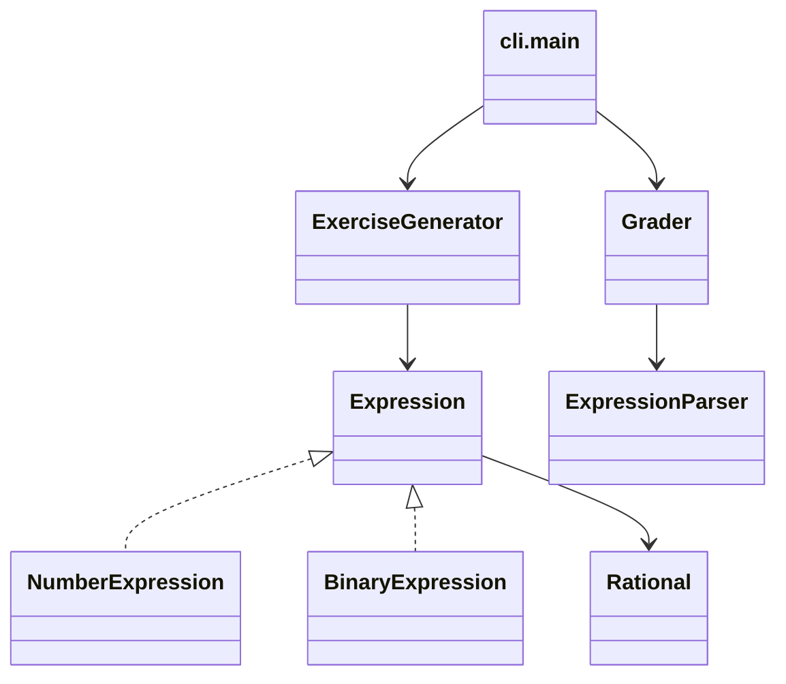
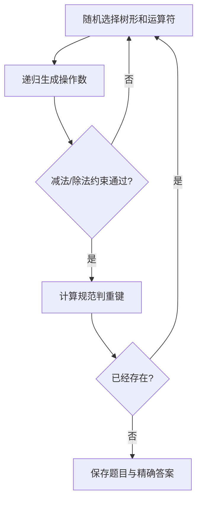
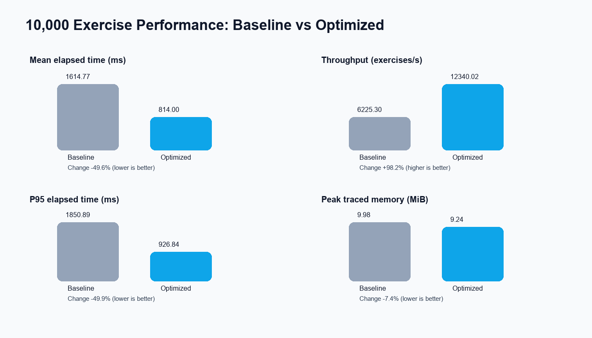
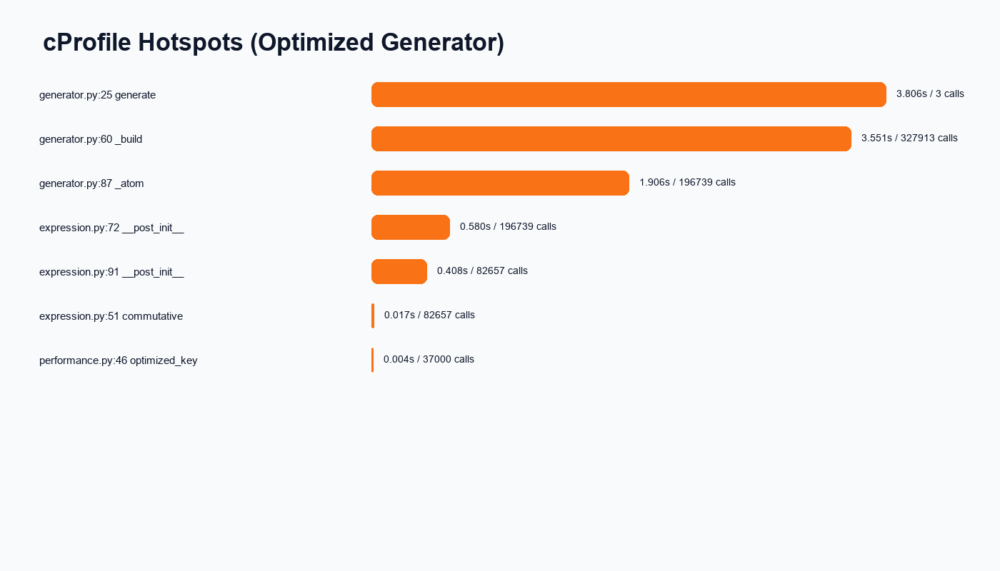

# 结对项目：小学四则运算题目生成器

- 翁佳华，3224004345
- 廖颖欣，3224004307
- GitHub：<https://github.com/Huahetai-cell/pair-arithmetic>
- 课程：<https://edu.cnblogs.com/campus/gdgy/Class78-Grade2024-CS/>
- 作业：<https://edu.cnblogs.com/campus/gdgy/Class78-Grade2024-CS/homework/15703>

## PSP 估算

> 以下为实现前估算；实际时间必须在工作完成后根据真实记录填写。

| PSP2.1 阶段 | 预计耗时（分钟） | 实际耗时（分钟） |
|---|---:|---:|
| 计划与需求分析 | 45 | 待填写 |
| 设计 | 90 | 待填写 |
| 编码 | 360 | 待填写 |
| 代码复审 | 60 | 待填写 |
| 测试与修复 | 180 | 待填写 |
| 性能分析与优化 | 120 | 待填写 |
| 文档与博客 | 150 | 待填写 |
| 合计 | 1005 | 待填写 |

## 设计与实现

生成器构造包含一至三个运算符的表达式树。节点创建时立即以 Python `Fraction` 精确求值，减法和除法候选不符合约束便拒绝。规范判重键只在加法、乘法节点交换两个直接子树，不展开结合律。

关键实现包括：`Fraction` 自动约分；`Binary` 节点缓存求值和判重键；`ExpressionParser` 按优先级解析；`Grader` 重新计算答案而不是进行字符串比较。

## 测试用例

1. `1/6 + 1/8` 得到 `7/24`。
2. `2’3/8` 能解析并保持规范格式。
3. 分母为零时拒绝输入。
4. 生成题目的运算符均为一至三个。
5. 所有减法节点结果非负。
6. 所有除法节点结果严格大于0且小于1。
7. `23 + 45` 与 `45 + 23` 判重键相同。
8. `(1 + 2) + 3` 与 `(3 + 2) + 1` 判重键不同。
9. 缺少 `-r` 时输出帮助并返回失败状态。
10. 正确、错误、缺失和非法答案均能正确统计。
11. 输出文件的编号、空格、等号和编码符合要求。
12. 一次生成10000道题后数量准确且没有重复。

## 性能分析

运行 `tools/performance.ps1` 后自动得到真实数据。相同种子与环境下，基线平均耗时1614.77ms，优化版814.00ms，平均耗时下降49.6%，吞吐量提升98.2%。优化点是避免为每个候选表达式反复格式化、解析和重建判重结构，直接使用表达式节点缓存的规范键。cProfile 显示优化版累计时间主要集中在递归构造 `_build` 和随机操作数 `_atom`。

原始CSV、cProfile分析文件和自动汇总报告均保存在 `docs/performance`。分析与优化的人工实际耗时仍需两位成员按真实工作记录填写。

## 项目小结与结对感受

此部分由两位成员在完成结对开发后共同填写，包括成功之处、遇到的问题、经验教训，以及对方在沟通、设计、编码或测试中的闪光点和改进建议。
