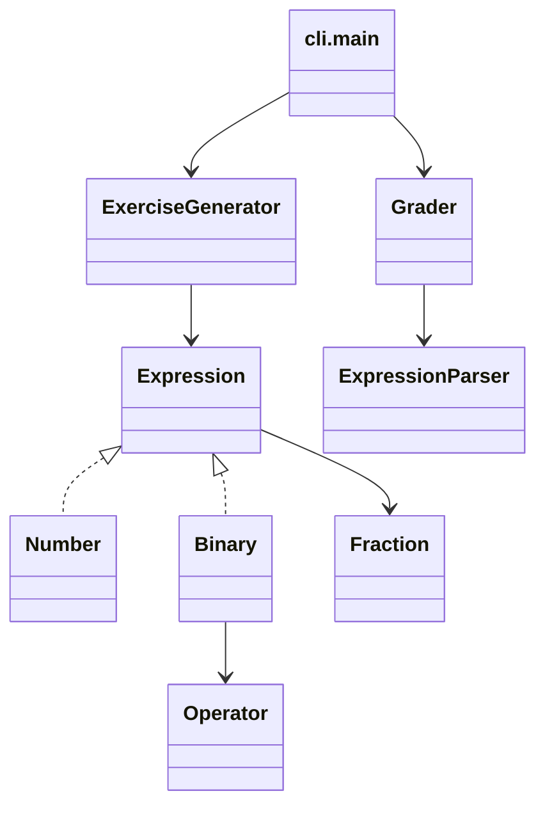
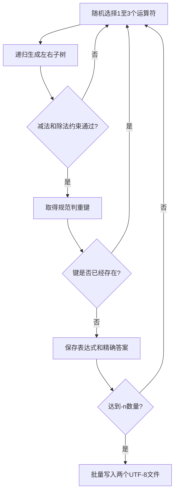

# 结对项目：小学四则运算题目生成器

| 项目 | 内容 |
|---|---|
| 成员1 | 翁佳华，3224004345 |
| 成员2 | 廖颖欣，3224004307 |
| GitHub | <https://github.com/Huahetai-cell/pair-arithmetic> |
| 课程 | <https://edu.cnblogs.com/campus/gdgy/Class78-Grade2024-CS/> |
| 作业要求 | <https://edu.cnblogs.com/campus/gdgy/Class78-Grade2024-CS/homework/15703> |

> 【需截图 S1：GitHub 仓库主页或 Commits 页面，体现公开仓库、main分支及增量提交。】

## 一、需求分析

本项目实现一个小学四则运算题目生成与批改程序。生成模式通过 `-n` 控制题目数量，通过 `-r` 控制数值范围；每题包含1～3个运算符，支持自然数、真分数、带分数、四则运算和括号。程序保证任何减法子表达式不产生负数，任何除法子表达式的结果严格满足 `0 < result < 1`。

除题目和答案文件外，程序还支持读取指定题目文件与答案文件，统计正确和错误题号并输出 Grade.txt。重复题的定义不是简单字符串比较：加法和乘法允许交换左右子树，但不使用结合律任意展平表达式。程序还必须稳定支持一次生成10000道不重复题目。

为了便于教师直接运行，我们既保留了 Python 源码入口，也使用 PyInstaller 生成了 Windows 单文件程序 `Myapp.exe`。

## 二、PSP 表格

项目开始前的时间估计如下。实际时间一栏必须由两位成员根据真实开发记录补全，不能用估计值代替。

| PSP2.1 阶段 | 预计耗时（分钟） | 实际耗时（分钟） |
|---|---:|---:|
| 计划与需求分析 | 45 | 【填写】 |
| 设计 | 90 | 【填写】 |
| 编码 | 360 | 【填写】 |
| 代码复审 | 60 | 【填写】 |
| 测试与修复 | 180 | 【填写】 |
| 性能分析与优化 | 120 | 【填写】 |
| 文档与博客 | 150 | 【填写】 |
| 合计 | 1005 | 【填写合计】 |

## 三、开发环境与项目组织

- 语言：Python 3.12，兼容 Python 3.10+
- 精确计算：标准库 `fractions.Fraction`
- 测试：标准库 `unittest`
- 性能分析：`cProfile`、`tracemalloc`、`time.perf_counter_ns`
- 图表输出：Pillow
- EXE 打包：PyInstaller
- 版本管理：Git、GitHub，默认分支为 `main`

项目主要目录如下：

```text
pair-arithmetic/
├─ Myapp.py                    # 源码运行入口
├─ src/arithmetic/
│  ├─ cli.py                   # 参数处理和文件输出
│  ├─ expression.py            # 表达式树、运算符、分数格式化
│  ├─ generator.py             # 受约束随机生成和判重
│  ├─ parser.py                # 递归下降解析器
│  └─ grader.py                # 答案批改
├─ tests/                      # 19项自动测试
├─ tools/                      # 性能、验收和打包脚本
├─ samples/                    # 可复现判题样例
└─ docs/                       # 博客、性能和验收报告
```

## 四、设计实现过程

### 4.1 模块关系



如果博客平台不能渲染 Mermaid，可在支持 Mermaid 的编辑器中导出为 PNG 后插入。

### 4.2 表达式树和精确计算

数字节点 `Number` 保存一个 `Fraction`；二元节点 `Binary` 保存左子树、运算符和右子树。节点创建时立即计算并缓存结果、运算符数量和规范判重键。这样生成、输出、批改和性能分析都使用同一种数据结构，避免不同模块对表达式含义理解不一致。

使用 `Fraction` 而不是浮点数非常重要。例如 `1/6 + 1/8` 会精确得到 `7/24`，不会出现 `0.291666...` 一类误差。输出时根据数值自动选择自然数、普通分数或 `2’3/8` 格式。

### 4.3 生成流程



减法仅在左值大于等于右值时创建；除法要求左值大于0且小于右值，因此商必然是真分数。生成器还设置最大尝试次数，当很小的范围无法提供足够多的唯一题目时会明确报错，而不是无限循环。

### 4.4 重复题判定

每个数字节点生成形如 `N[1/2]` 的键。对于减法、除法，左右子树顺序原样保留；对于加法、乘法，两个直接子树的键按字典序排列。因此：

- `23 + 45` 与 `45 + 23` 的键相同；
- `3 + (2 + 1)` 与 `(1 + 2) + 3` 可以通过有限次交换得到相同结构；
- `(1 + 2) + 3` 与 `(3 + 2) + 1` 的内部子树不同，不会被错误地当作同一道题。

我们没有把连续加法或乘法展平成集合，因此严格遵循题目所描述的“有限次交换左右表达式”，没有额外使用结合律。

### 4.5 表达式解析与批改

`ExpressionParser` 使用递归下降方法，依次处理加减、乘除和括号/数字三个优先级层次，并按左结合构造表达式树。批改时不是比较答案字符串，而是重新解析题目、精确计算标准值，再把用户答案解析为 `Fraction` 比较，所以 `1/2` 与 `2/4` 会被视为相同答案。缺失答案或格式非法的答案计入 Wrong。

## 五、关键代码说明

### 5.1 减法与除法约束

```python
if operator is Operator.SUBTRACT and left.value < right.value:
    stats.constraint_rejects += 1
    return None
if operator is Operator.DIVIDE and (left.value <= 0 or left.value >= right.value):
    stats.constraint_rejects += 1
    return None
```

在表达式树创建之前拒绝非法候选，使所有嵌套子表达式也满足要求，而不仅仅检查最终答案。

### 5.2 加法和乘法规范键

```python
left_key, right_key = self.left.canonical_key, self.right.canonical_key
if self.operator.commutative and left_key > right_key:
    left_key, right_key = right_key, left_key
self.canonical_key = f"{self.operator.name}({left_key},{right_key})"
```

规范键由树结构递归产生，集合查询平均为 O(1)，能够支撑万人题判重。

### 5.3 批改统计

```python
expected = parser.parse(exercise_text).value
if supplied is not None and parse_fraction(supplied) == expected:
    correct.append(number)
else:
    wrong.append(number)
```

这种做法允许答案使用等值分数，同时把缺失、错误和非法格式统一归入 Wrong。

## 六、程序运行与输入输出

查看帮助：

```powershell
.\dist\Myapp.exe --help
```

> 【需截图 S2：帮助信息，包含生成和批改两组参数。】

生成10道题：

```powershell
.\dist\Myapp.exe -n 10 -r 10
Get-Content .\Exercises.txt -Encoding UTF8
Get-Content .\Answers.txt -Encoding UTF8
```

> 【需截图 S3：生成命令、Exercises.txt 和 Answers.txt。可以分成两张图。】

非法参数能够得到帮助信息和非零退出状态：

```powershell
.\dist\Myapp.exe -n 10
```

> 【需截图 S4：缺少-r时的错误信息。】

批改固定样例：

```powershell
.\dist\Myapp.exe -e .\samples\Exercises-demo.txt -a .\samples\Answers-demo.txt
Get-Content .\Grade.txt -Encoding UTF8
```

预期结果为：

```text
Correct: 2 (1, 5)
Wrong: 3 (2, 3, 4)
```

> 【需截图 S5：判题命令和Grade.txt结果。】

## 七、测试与正确性说明

### 7.1 测试用例

| 编号 | 测试内容 | 预期结果 |
|---:|---|---|
| 1 | `1/6 + 1/8` | 精确得到 `7/24` |
| 2 | 解析 `2’3/8` | 得到 `19/8` 并按带分数输出 |
| 3 | 输入 `1/0` | 拒绝分母为0 |
| 4 | 表达式优先级 `1 + 2 * 3` | 结果为7 |
| 5 | 生成500题并递归检查 | 每个减法非负、每个除法结果在0和1之间 |
| 6 | 交换 `23 + 45` | 与 `45 + 23` 判为重复 |
| 7 | 比较两种不同结合结构 | 不使用结合律错误去重 |
| 8 | 缺失 `-r`、零或非整数参数 | 显示帮助并返回错误状态 |
| 9 | 正确、错误、缺失和非法答案 | 正确归入 Correct/Wrong |
| 10 | UTF-8 BOM文件 | 能正常读取并批改 |
| 11 | 连续生成20题再生成3题 | 文件被覆盖为3行，不追加旧内容 |
| 12 | 一次生成10000题 | 数量正确，规范判重键全部唯一 |

自动测试命令：

```powershell
$env:PYTHONPATH = "$PWD\src"
python -m unittest discover -s tests -v
```

当前19项测试全部通过。

> 【需截图 S7：测试末尾的 `Ran 19 tests` 和 `OK`。】

### 7.2 黑盒输入输出验收

我们还使用真实 `Myapp.exe` 进行了13个黑盒场景检查，包括帮助、参数缺失、非法数字、未知参数、模式冲突、文件不存在、最小范围、普通生成、万人题、批改矩阵和覆盖写。对生成的每一道题都重新解析，并比较精确答案和规范判重键。最终结果为 `13/13 I/O cases passed`。

```powershell
python .\tools\io_validation.py
```

完整结果保存在 [`docs/io-validation.md`](io-validation.md)。

> 【需截图 S6：万人题行数/耗时和 `13/13 I/O cases passed`。】

这些测试不仅检查“程序能运行”，还验证了中间子表达式约束、输出语法、精确答案、编号、唯一性、编码和异常路径，因此能够较全面地说明程序正确性。

## 八、性能分析与优化

性能测试固定使用 `-n 10000 -r 10`，基线和优化版每轮使用相同随机种子，先预热3轮，再正式测量7轮。基线策略每次都把表达式格式化为文本、重新解析并构造判重键；优化版在表达式节点创建时缓存结果和规范键。

| 策略 | 平均耗时(ms) | 中位数(ms) | P95(ms) | 吞吐量(题/秒) | 峰值内存(MiB) |
|---|---:|---:|---:|---:|---:|
| 基线 | 1614.77 | 1570.02 | 1850.89 | 6225.30 | 9.98 |
| 优化版 | 814.00 | 812.88 | 926.84 | 12340.02 | 9.24 |

优化后平均耗时下降49.6%，吞吐量提高98.2%。这说明缓存规范键避免了大量字符串构造和重复解析，优化方向与剖析结果一致。


`cProfile` 显示优化后的主要累计耗时位于递归生成函数 `_build` 和随机操作数函数 `_atom`，而读取缓存键 `optimized_key` 的耗时很小。


> 【截图 S8：以上两张图已经生成，可直接上传到博客；若外链无法显示，请上传本地 `docs/performance` 中的PNG。】

原始数据、性能报告和可复查的 cProfile 文件均保存在 `docs/performance`。性能分析与优化实际人工耗时请在 PSP 表中按真实记录填写。

## 九、项目小结

本项目最重要的设计决定是用表达式树和精确分数统一生成、计算、格式化、判重与批改。这样避免了浮点误差，也使“检查每一个减法或除法子表达式”成为自然的递归过程。规范结构键解决了字符串比较无法识别交换等价题的问题，有限重试则避免极小范围下无限循环。

在实现过程中，我们还认识到功能正确并不等于交付完整。除单元测试外，项目增加了真实EXE黑盒验收、自动性能报告、可复现输入文件、构建脚本和明确的提交历史。这些材料使运行结果能够被重复验证，也为博客中的结论提供了数据依据。

项目仍可继续改进：例如增加图形界面、允许通过可选参数固定随机种子、在持续集成环境中自动运行测试，以及为不同题目难度设计更细致的分布策略。

## 十、结对感受与相互评价

> 本节必须由两位成员根据真实合作情况修改后再发布。以下提供可直接补充的结构，不建议原样保留括号内容。

### 翁佳华的结对感受

在本次项目中，我主要负责【填写实际负责内容】。结对过程中给我帮助最大的是【填写具体事件】，它让我认识到【填写收获】。廖颖欣的闪光点是【填写具体优点和例子】；我的建议是【填写善意且具体的建议】。

### 廖颖欣的结对感受

在本次项目中，我主要负责【填写实际负责内容】。我印象最深的问题是【填写具体问题】，我们通过【填写协作方式】解决了它。翁佳华的闪光点是【填写具体优点和例子】；我的建议是【填写善意且具体的建议】。

### 共同总结

两人一致认为，结对开发的价值不只是把任务拆成两份，而是通过设计讨论、代码复审和交叉测试尽早发现个人容易忽略的问题。后续合作中，我们会继续改进任务记录、提交粒度和沟通节奏，使双方都能持续了解项目整体状态。

---

发布前请完成三项工作：填写PSP实际时间；补全两人的真实感受；按 [`docs/local-test-guide.md`](local-test-guide.md) 完成S1～S8截图并替换本文中的提示文字。
